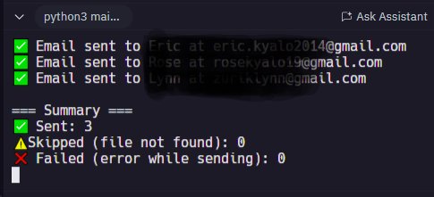

# 📧 Automated Bulk Invoice Emailer

This Python script automates the task of sending personalized invoice PDFs to multiple recipients via email. It reads data from a `clients.csv` file, fetches corresponding invoice files from an `invoices` folder, and sends them as secure email attachments via Gmail.

---

## ✅ Features

- Reads recipient names, emails, and PDF filenames from a CSV file.
- Automatically attaches matching invoice PDFs from the `invoices` folder.
- Uses environment variables for secure email credentials.
- Skips missing files and logs failed email attempts without crashing.
- Console-based delivery report with summary at the end.

---

## 🗂️ Folder Structure

project-folder/
│
├── main.py
├── clients.csv
├── invoices/
│ ├── invoice_john_2025-07-31.pdf
│ ├── invoice_mary_2025-07-31.pdf
│ └── invoice_jane_2025-07-31.pdf
├── screenshots/
│ └── email-invoice-sender-console.png
└── README.md


---

## 🛠️ How to Use

1. **Prepare your `.env` file** with your Gmail credentials:

    ```
    EMAIL_ADDRESS=your-email@gmail.com  
    EMAIL_PASSWORD=your-app-password
    ```

2. **Create a `clients.csv` file** with the following format:

    ```
    name,email,file
    John,john@example.com,invoice_john.pdf
    Mary,mary@example.com,invoice_mary.pdf
    Jane,jane@example.com,invoice_jane.pdf
    ```

3. **Put all invoice PDF files** into the `invoices/` folder.

4. **Run the script**:

    ```bash
    python main.py
    ```

    Check the console for a delivery report and verify emails in your Gmail “Sent” folder.

---

## 🖼️ Demo Screenshot



---

## 📌 Notes

- Make sure you enable **2-Step Verification** in Gmail and generate an **App Password**.
- The script uses **TLS over SMTP** for secure email transmission.
- Handles missing files and failed emails gracefully without halting execution.

---

## 👤 Author

**Eric Mutisya**  
Python Developer & Web Automation Freelancer  
[🔗 View My GitHub Projects](https://github.com/Ek-Coder-Tech)

---

## 📄 License

This project is open-source and available under the **MIT License**.

---

## 📬 Contact

For freelance inquiries or collaborations:  
📎 [View My Upwork Profile](https://www.upwork.com/freelancers/~012558bab6232e8e65)
